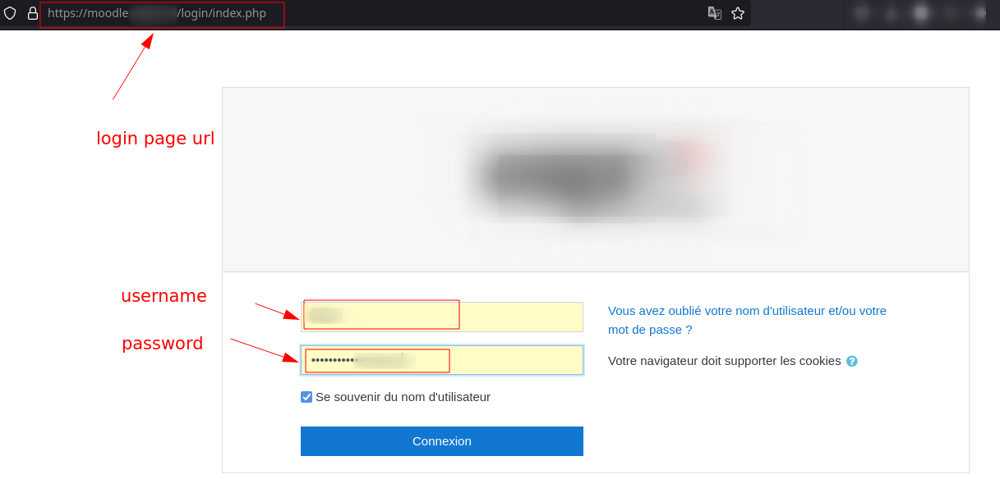
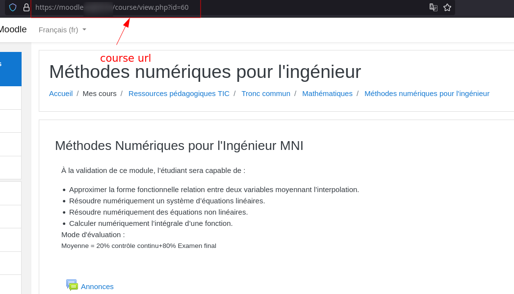
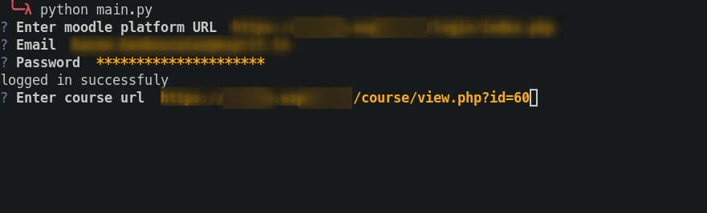
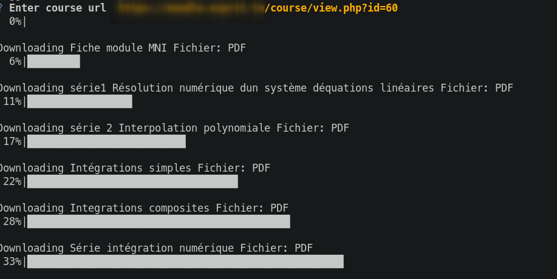

## General info
This project is moodle platform courses downloader (scrapes available resources and downloads them)
	
## Technologies
Project is created with:
* Python3
	
## Setup
### Clone Project
To run this project:

```
$ git clone https://github.com/HazemBZ/moodle_extractor
```

### Install dependencies
```sh
$ cd moodle_extractor/
$ python -m pip install requirements.txt
```

### Running script
```sh
$ python main.py
```

### Usage
#### 1.Note parameters
<p align="center" >
    
</p>

<p align="center" >
    
</p>

#### 2.Download course resources using the script
After running the script you will be asked to input the required parmeters

<p align="center" >
    
</p>

#### 3.Profit

<p align="center" >
    
</p>

❤️ Enjoy ❤️
